# **Lar Canino**

Este é um projeto [Next.js](https://nextjs.org/) inicializado com [`create-next-app`](https://github.com/vercel/next.js/tree/canary/packages/create-next-app).

## **Índice:**

1. [Sobre o projeto](#sobre-o-projeto-lar-canino);
2. [Principais desafios](#principais-desafios);
3. [O que mais gostei](#o-que-mais-gostei);
5. [Tecnologias/linguagens utilizadas](#tecnologiaslinguagens-utilizadas);
6. [Instruções](#instruções);
7. [Imagens do projeto](#imagens-do-projeto);
8. [Status](#status);
9. [Contato](#contato);

## **Sobre o projeto Lar Canino**

Decidi tentar reproduzir um design que encontrei no Pinterest/Dribbble de um site fictício de um abrigo para animais.  
Preferi utilizar uma temática voltada para cães, porque sou uma dog lover.  
Meu objetivo era reproduzir fielmente (na medida do possível) o design, traduzindo-o para o português e adaptando conforme minhas preferências. 
As devidas atribuições se encontram no link Atribuições ao final da página.

## **Principais desafios**

- Transformar o design do Dribbble em algo com o que eu pudesse trabalhar no Figma. Tive que recriar as seções, pelo menos da página principal, do zero, fazendo as adaptações em que pensava na hora.
- Criar um arquivo JSON com o qual eu pudesse trabalhar para renderizar as imagens e informações dos cãezinhos (a ideia inicial era usar uma API desenvolvida por mim, mas decidi usar um JSON neste projeto apenas para começar a testar).
- Ajustar a responsividade, visto que só a versão desktop estava disponível.
- Criar a página "Agende uma visita" do zero. Apesar de ser um formulário simples, ainda assim, fiquei um tempo pensando na melhor forma de fazer. Relacionado a isso também, aprender a usar o React Hook Form para lidar com o formulário.
- Criar o modal padrão e o carrossel do absoluto zero.
- Implementar um estado de loading com skeletons para os cards dos cães.

## **O que mais gostei**

- Todas as partes dos desafios que enfrentei, bem como a parte de criar os textos fictícios, tanto para representar o abrigo quanto para os cãezinhos. Usei do auxílio do ChatGPT e do Chat Bing nessa parte.
- Acredito que não segui uma arquitetura ideal para a estrutura dos componentes, mas ainda estou estudando para tornar essa parte mais organizada e manutenível.

## **Demais implementações**
- Scrollbar personalizada;
- Favicon personalizado;

## **Tecnologias/linguagens utilizadas:**

 
    
    
    
    

 

#

## **Instruções**

1. Alternativa 1:
    * Acesse [aqui](https://lar-canino.vercel.app/);

2. Alternativa 2:
    * Clone o repositório clicando em "Code" e copie a URL em HTTPS.
    * Na pasta onde deseja que o projeto fique, segure a tecla SHIFT e clique com o botão direito, e selecione "Git bash here" ou alguma outra opção que seja de sua preferência. Certifique-se de ter o Git instalado se for a primeira.
    * Dê o comando `git clone <URL-copiada>` e pressione Enter. Isso copiará o projeto.
    * Agora você pode abrir o projeto tanto pelo Git (fazendo o percurso `cd <nome-do-projeto>)` quanto pelo seu Editor de Código (IDE) preferido.
    * Instale as dependências necessárias do projeto com o comando `npm install` ou `npm i`, pelo terminal ou diretamente pela IDE.
    * Execute o comando `npm run dev` no terminal e copie o link que aparece no terminal no seu navegador de preferência, ou segure CTRL e clique com o botão esquerdo do mouse no link, isso abrirá o projeto diretamente no último navegador utilizado.

## **Imagens do projeto**

    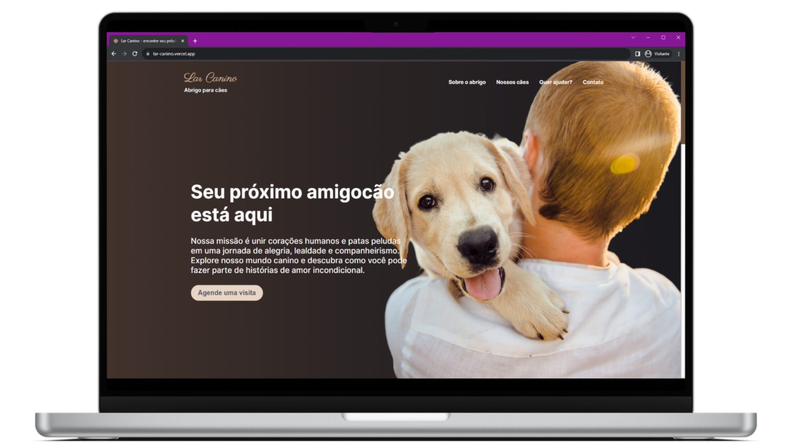
    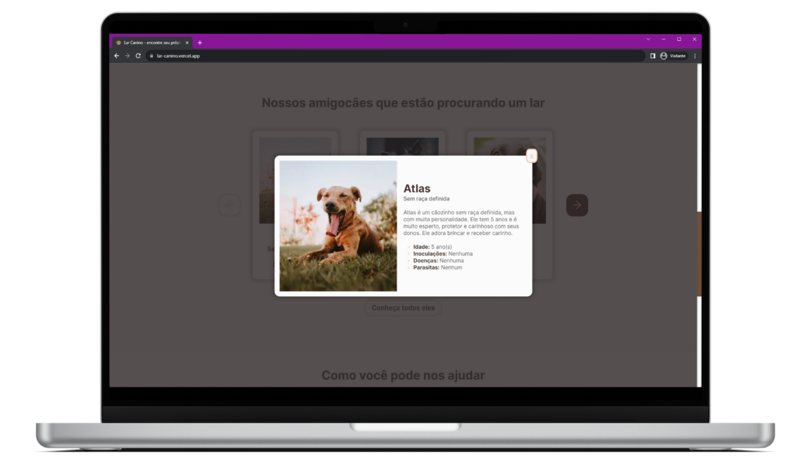
    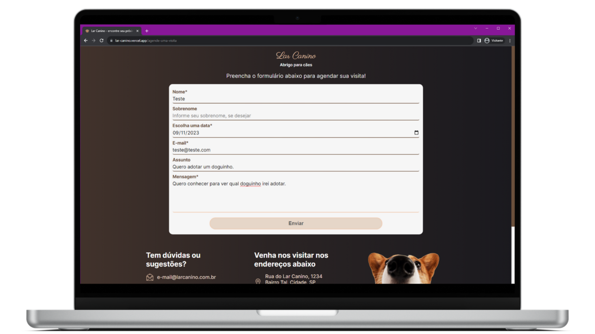
    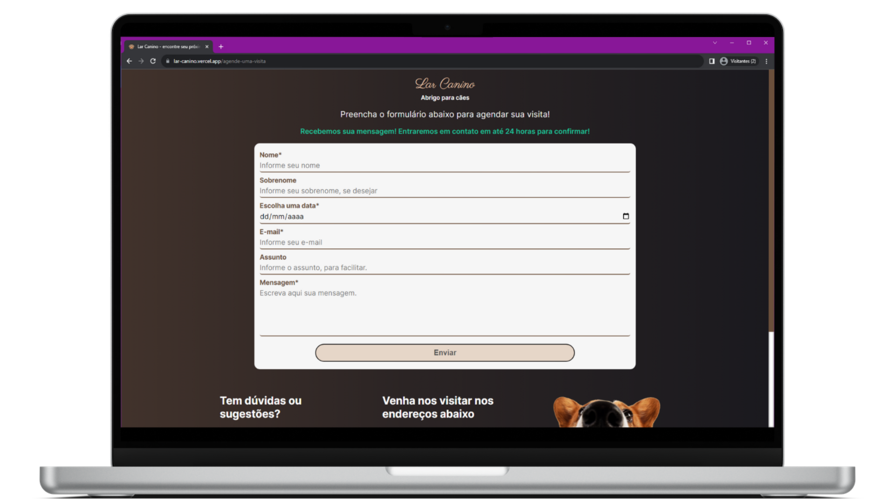
    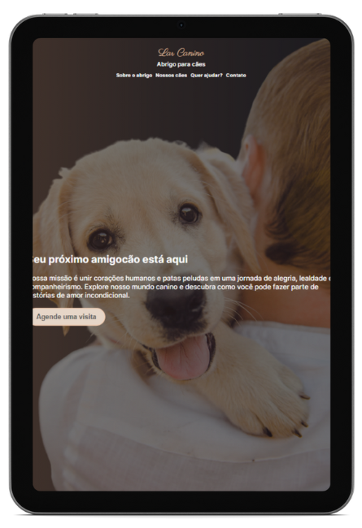
    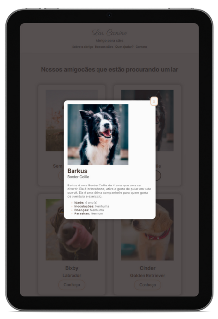
    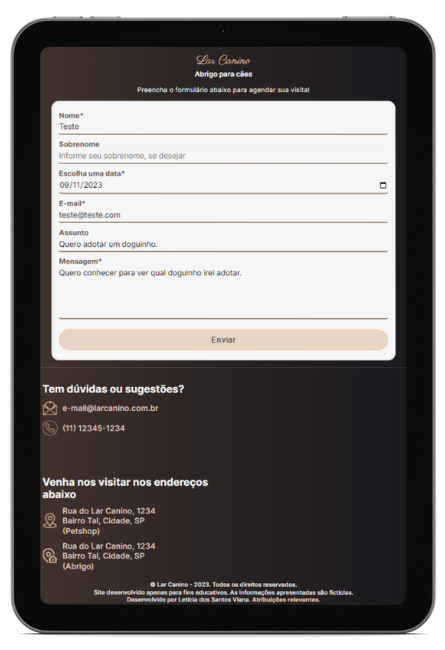 
    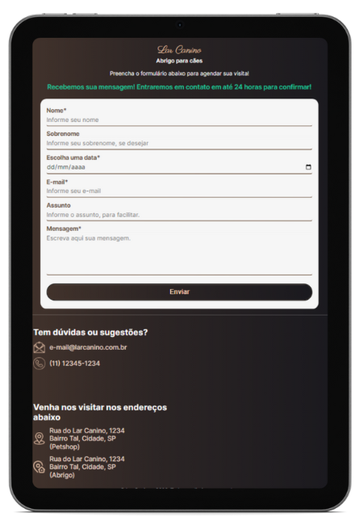 
    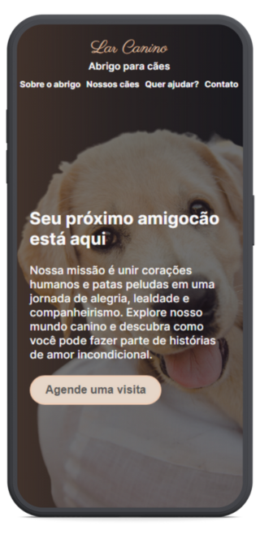
    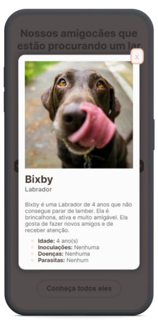
    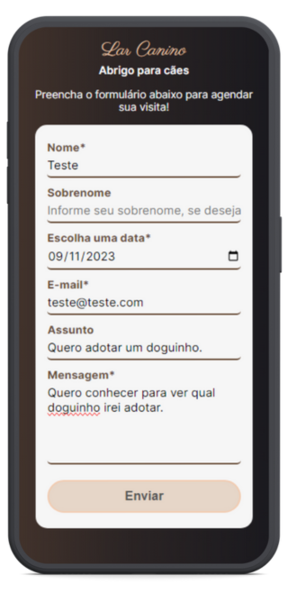
    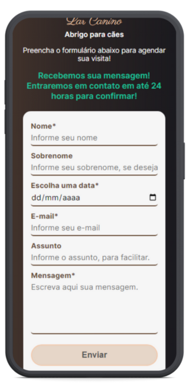 

## **Status**
- [x] Funcional;
- [x] Acredito que está responsivo;

## **Contato**
